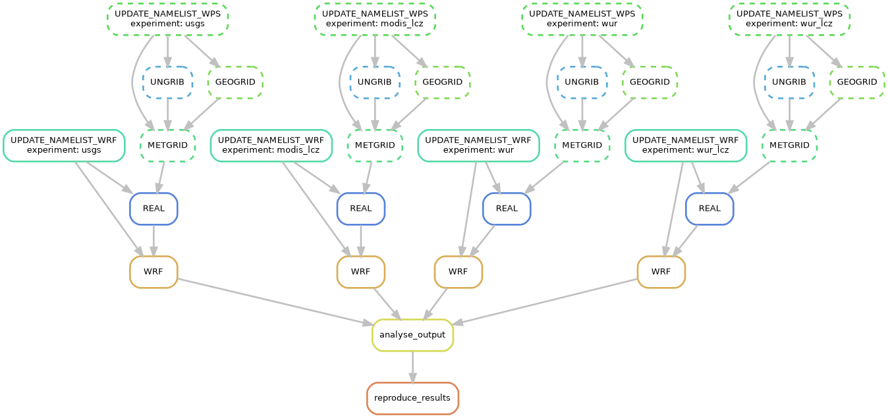

# Snakemake WRF

A snakemake workflow to run WRF, including pre- and postprocessing. See our [blog post](https://blog.esciencecenter.nl/un-wieldy-workflows-with-wrf-4a4947b88a98) for a detailed description.



Multiple experiments are defined in config.yaml:

- USGS: reference
- USGS + WUR parameters: reference setup from summer in the city
- CGLC-MODIS-LCZ: fancy new landuse dataset combining 100m CGLC data with 100m LCZ data
- CGLC-MODIS-LCZ + WUR parameters: same as above but including spatially explicity parameters from WUR

## Setup

```
# Configure mamba (first time only)
module load Mamba/23.1.0-4
mamba init

# Create environment (pin 3.11 for ecmwflibs dependency of w2w)
mamba create --name snakemake python=3.11 "numpy<2" bioconda::snakemake -y
mamba activate snakemake
pip install git+https://github.com/matthiasdemuzere/w2w@add_wrf_version

# Make sure netcdf is available for WPS and WRF (these instructions are specific to Snellius)
module load 2023
module load netCDF-Fortran/4.6.1-gompi-2023a  # also loads gcc and gompi
export NETCDF=$(nf-config --prefix)

# Run snakefile in this dir
snakemake --dryrun  # just see if it looks okay
snakemake --cores 1  # execute on 1 core
snakemake --cores 1 REAL  # only execute up to and including REAL

# Potentially set up alias for snakemake to circumvent annoying design decision.
# https://github.com/snakemake/snakemake/issues/312
alias snakemake="snakemake --cores 1"

# Visualize DAG using graphviz
snakemake --dag WRF_all | dot -Tsvg > dag.svg
snakemake --dag WRF_all | dot -Tpng > dag.png
```

## Notes

- ungrib and metgrid fail with 0 exit status. https://github.com/wrf-model/WPS/issues/252, thus read the logfile and scan for error
- ungrib doesn't overwrite existing FILE, instead raises "Fortran runtime error: Cannot open file ... file exists."
